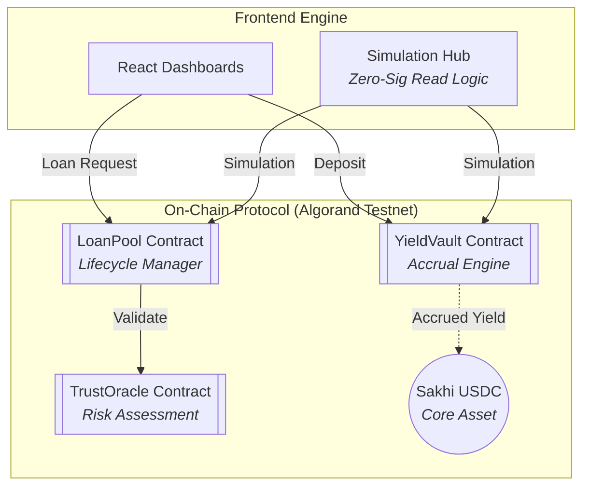

# SakhiLend Smart Contracts 🏗️

This repository contains the core financial logic for the SakhiLend protocol, built using **Puya TS** (TypeScript-to-TEAL) on the Algorand Virtual Machine (AVM).

## 📊 Protocol Architecture



## 📂 Core Contracts

### 1. [YieldVault](./smart_contracts/yield_vault) (App ID: `758818613`)
- **Purpose**: Provides automated yield generation for savers.
- **Logic**: Implements weighted balance tracking. Yield is accrued per block at a fixed 6% APY, ensuring that every "chai-break" earned by a Sakhi is mathematically verifiable on-chain.
- **Optimization**: Uses Box Storage for user balances to support unlimited scale.

### 2. [LoanPool](./smart_contracts/loan_pool) (App ID: `758818609`)
- **Purpose**: Facilitates P2P microlending.
- **Flow**: `Request` (Borrower) → `Approve` (Admin/Risk) → `Disburse` (Escrow) → `Repay` (Borrower).
- **Features**: Supports partial funding and simple interest calculation adjusted for the block-based economy.

### 3. [TrustOracle](./smart_contracts/trust_oracle) (App ID: `758818612`)
- **Purpose**: Bridges off-chain creditworthiness (Mann Deshi scorecards) to the AVM.
- **Data Integrity**: Records encrypted hashes of scorecard data, allowing the `LoanPool` to verify risk without exposing PII (Personally Identifiable Information).

## 🚀 Deployment & Development

### Local Development
```bash
# Start local environment
algokit localnet start

# Deploy to localnet
algokit project deploy localnet
```

### Testnet Production
Current contracts are active on **Algorand Testnet**:
- **USDC ID**: `758817439`
- **Nodes**: `https://testnet-api.algonode.cloud`

## 🛡 Security & Design Patterns
- **MBR Management**: All box storage costs are covered via prepayments (`mbrPayment`) during the request/deposit phase, ensuring the protocol remains self-sustaining.
- **Admin Multisig Ready**: Contracts feature gated administrative methods (`approveLoan`, `bootstrap`) authorized via creator-control patterns.
